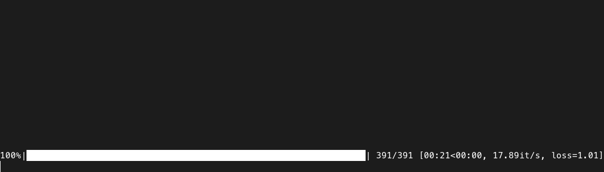
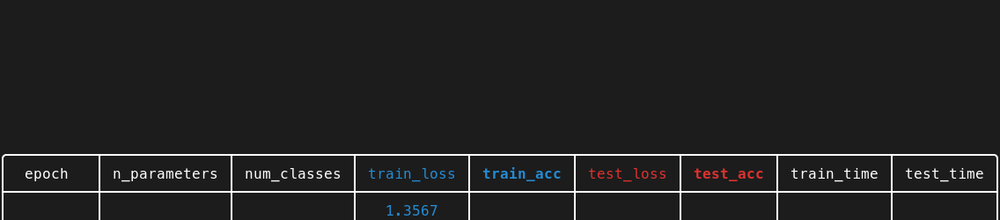
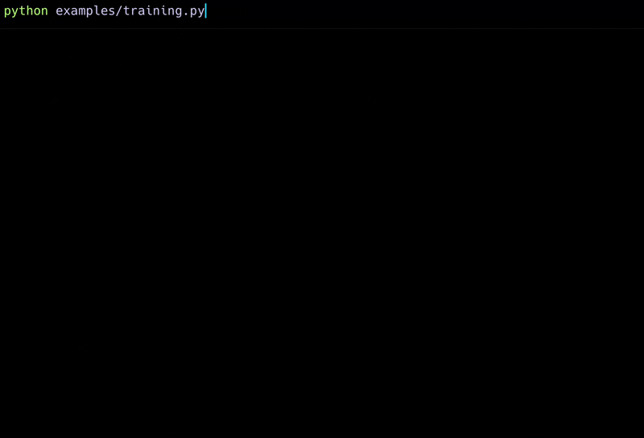
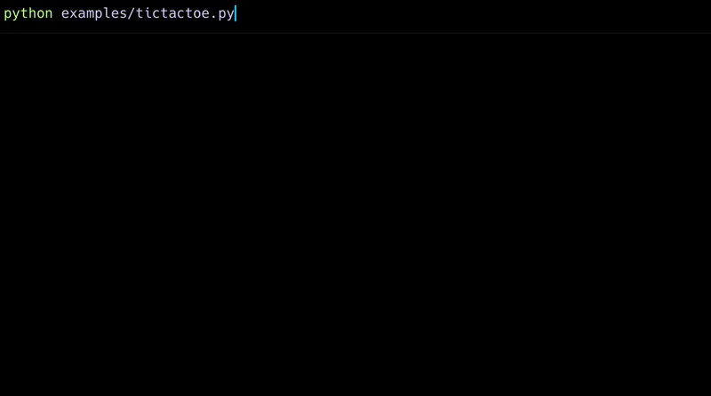

> Version 2.X introduces new features and new interactive modes.
>
> New features allow for previously impossible applications, see examples below.

# Progress Table

[](https://pypi.org/project/progress-table)
[](https://pypi.org/project/progress-table)

Lightweight utility to display the progress of your process as a pretty table in the command line.

* Alternative to TQDM whenever you want to track metrics produced by your process
* Designed to monitor ML experiments, but works for any metrics-producing process
* Allows you to see at a glance what's going on with your process
* Increases readability and simplifies your command line logging

### Change this:



### Into this:



## Examples

* Neural network training



* Progress of multi-threaded downloads


* Simulation and interactive display of Brownian motion


* Display of a game board



## Quick start code

```python
import random
import time

from progress_table import ProgressTable

# Create table object:
table = ProgressTable(num_decimal_places=1)

# You can (optionally) define the columns at the beginning
table.add_column("x", color="bold red")

for step in range(10):
    x = random.randint(0, 200)

    # You can add entries in a compact way
    table["x"] = x

    # Or you can use the update method
    table.update("x", value=x, weight=1.0)

    # Display the progress bar by wrapping an iterator or an integer
    for _ in table(10):  # -> Equivalent to `table(range(10))`
        # Set and get values from the table
        table["y"] = random.randint(0, 200)
        table["x-y"] = table["x"] - table["y"]
        table.update("average x-y", value=table["x-y"], weight=1.0, aggregate="mean")
        time.sleep(0.1)

    # Go to the next row when you're ready
    table.next_row()

# Close the table when it's finished
table.close()

```

> Go to [integrations](docs/integrations.md)
> page to see examples of integration with deep learning libraries.

## Advanced usage

Go to [advanced usage](docs/advanced-usage.md) page for more information.

## Troubleshooting

### Exceesive output

Progress Table works correctly in most consoles, but there are some exceptions:

* Some cloud logging consoles (e.g. kubernetes) don't support `\r` properly.
  You can still use ProgressTable, but with `interactive=0` option. This mode will not display progress bars.
* Some consoles like `PyCharm Python Console` or `IDLE` don't support cursor movement.
  You can still use ProgressTable, but with `interactive=1` option. This mode displays only 1 progress bar at once.

> By default `interactive=2`. You can change the default `interactive` with an argument when creating the table object
> or by setting `PTABLE_INTERACTIVE` environment variable, e.g. `PTABLE_INTERACTIVE=1`.

## Installation

Install Progress Table easily with pip:

```
pip install progress-table
```

## Links

* [See on GitHub](https://github.com/gahaalt/progress-table)
* [See on PyPI](https://pypi.org/project/progress-table)

## Alternatives

* Progress bars: great for tracking progress, but they don't provide ways to display data in clear and compact way
    * `tqdm`
    * `rich.progress`
    * `keras.utils.Progbar`

* Libraries displaying data: great for presenting tabular data, but they lack the progress tracking aspect
    * `rich.table`
    * `tabulate`
    * `texttable`
