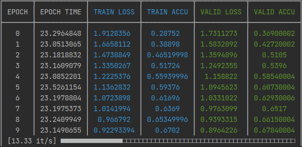

# Progress Table

Display progress as a pretty table in CLI.

Designed to monitor machine learning experiments, but can be used for anything.

## Alternatives

* `tqdm`: great and quick tool, but combining CLI logging with it is not pretty
* `keras.utils.Progbar`: as above